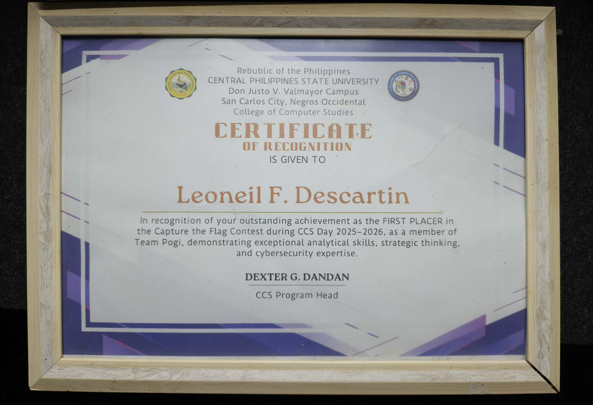

# 🏆 CTF Writeups — Leoneil F. Descartin

> Collection of my CTF competition writeups, certificates, and cybersecurity achievements.

---

## 🥇 Certificates & Awards

### 1st Place — CTF Competition, CCS Day 2025–2026

> **Central Philippines State University** — College of Computer Studies  
> Team Pogi | Duo Category  
> Signed by: Dexter G. Dandan, CCS Program Head

---

## 📋 CTF Categories Competed

| Category | Status |
|---|---|
| 🛡️ General Skills | ✅ Competed |
| 🌐 Web Enumeration | ✅ Competed |
| 🔍 Digital Forensics | ✅ Competed |
| 🔐 Cryptography | ✅ Competed |

---

## 🔧 Tools Used
- Kali Linux (no internet environment)
- Standard CTF tools

---

*More writeups coming soon as I continue my SOC Analyst journey!* 🚀
